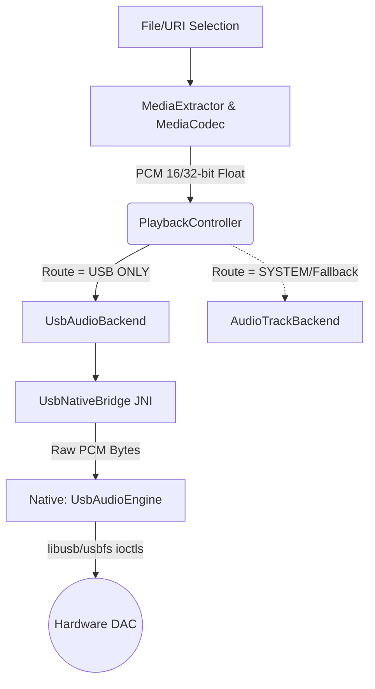

# USB Audio Engine Architecture & Flow

This document outlines the end-to-end data flow and architectural design of the custom Bit-Perfect USB Audio Engine implemented in this application. This architecture closely mirrors the low-level bypassing techniques originally pioneered by USB Audio Player Pro (UAPP) and Neutron Music Player.

## 1. High-Level Data Flow Pipeline

The audio playback pipeline is decoupled from Android's `AudioTrack` and `AudioFlinger` frameworks. The flow is as follows:

### Decoding & State Management
- **MediaDecoderSource**: Wraps standard Android `MediaExtractor` and `MediaCodec`. It strictly decodes the source file (FLAC, WAV, MP3) into raw PCM streams. We configure it to extract native bit-depths (outputting cleanly as 16-bit or 32-bit Float PCM) without relying on system-level mixing or resamplers.
- **PlaybackController**: An asynchronous Kotlin Coroutine manager. It runs a continuous decoding loop on an IO thread. It pulls PCM chunks from the decoder and immediately pushes them to the active `PlaybackBackend`.
- **Atomic Routing**: By maintaining state inside `PlaybackController`, routing switches (from Internal AudioTrack to USB) happen identically to UAPP—by shutting down the active backend and hot-swapping a new one while maintaining the same buffered source decoder.

## 2. USB Routing & Exclusivity (The Discovery Phase)

For an application to send unbroken bit-perfect data to a DAC, it must first own the hardware entirely.

1. **UsbAudioRouteManager**: Scans attached devices using the Android `UsbManager`. It safely identifies audio streaming endpoints (`USB_CLASS_AUDIO`) across both UAC1 and UAC2 devices, ignoring non-audio generic charging hubs.
2. **Permission Grant**: Android asks the user for explicit permission to access the USB device. 
3. **Session Hand-Off**: Once authorized, the underlying `FileDescriptor` is passed down to the C++ engine layer via JNI alongside the device's RAW USB descriptors.

## 3. The Native USB Engine (`usb_audio_engine.cpp`)

To achieve bit-perfect output, Android's built-in ALSA `snd-usb-audio` mixer is bypassed entirely by executing transfers in native C++.

### A. Descriptor Parsing (`descriptor_parser.cpp`)
The parser traverses the raw USB descriptors to find the exact hardware parameters of the plugged-in DAC:
- **Formats & Alt Settings**: It parses the `CS_INTERFACE` to identify supported Bit Depths, Sample Rates, Subframe Sizes, and max packet boundaries. 
- **UAC1 vs UAC2 Adaptability**: Both legacy Audio Class 1.0 (1ms intervals) and modern Audio Class 2.0 (High-Speed 125µs microframes) are scanned to ensure maximum hardware compatibility.

### B. Evicting the Android OS (`USBDEVFS_DISCONNECT_CLAIM`)
Like UAPP, the engine uses the `USBDEVFS_DISCONNECT_CLAIM` IOCTL on the device file descriptor. This is the **most critical step for bit-perfect audio**:
- It searches for any active kernel driver (the Android system ALSA driver) and forcefully detaches it.
- This releases the DAC from the Android AudioFlinger mixer, un-hijacking the sample-rate clock.
- The engine then exclusively claims the audio interface (`USBDEVFS_CLAIMINTERFACE`).

### C. Hardware Rate Negotiation
Once claimed, the engine sends a Class-Specific Control Transfer (`kUacSetCur / kUacEndpointSamplingFreqControl`) directly to the Endpoint 0 control interface. This forces the physical DAC internal hardware clock to match the source file's original frequency exactly (e.g., locking to 44.1kHz).

### D. Dynamic Bit-Padding Repacker
Many high-end audiophile DACs only advertise 24-bit or 32-bit pathways. If the user plays a 16-bit CD-quality FLAC, standard mismatched inputs would cause static. To solve this without breaking bit-perfect integrity, the native transfer loop does real-time endian-aware **zero-padding**. It safely repackages exact 16-bit payload streams into 24-bit / 32-bit physical containers specifically requested by the DAC's format alt-setting.

### E. The Isochronous Transfer Loop (URBs)
The continuous asynchronous data pump:
1. **Ring Buffer**: Kotlin PCM buffers generated by `MediaCodec` are written to a native `BoundedRingBuffer` to absorb scheduling jitter.
2. **URB Submission**: The native thread bundles raw PCM frames into `usbdevfs_urb` structures specifically marked as Isochronous (`USBDEVFS_URB_TYPE_ISO`).
3. **Reaping**: `ioctl(USBDEVFS_REAPURB)` continuously collects completed packet deliveries and submits new ones in a tight loop. Because it operates at the kernel IOCTL boundary, there is zero data alteration.

## 4. Summary: How It Compares to UAPP
- **UAPP Engine**: Bypasses Android's audio infrastructure by building custom USB drivers in user-space, manually negotiating descriptors, and submitting USB Isochronous packets via IOCTLs.
- **This Engine**: Functions identically. It handles its own descriptor parsing, detaches the system ALSA driver dynamically, and runs a pure native C++ URB Isochronous transfer loop strictly preserving the source format and sample rate.
